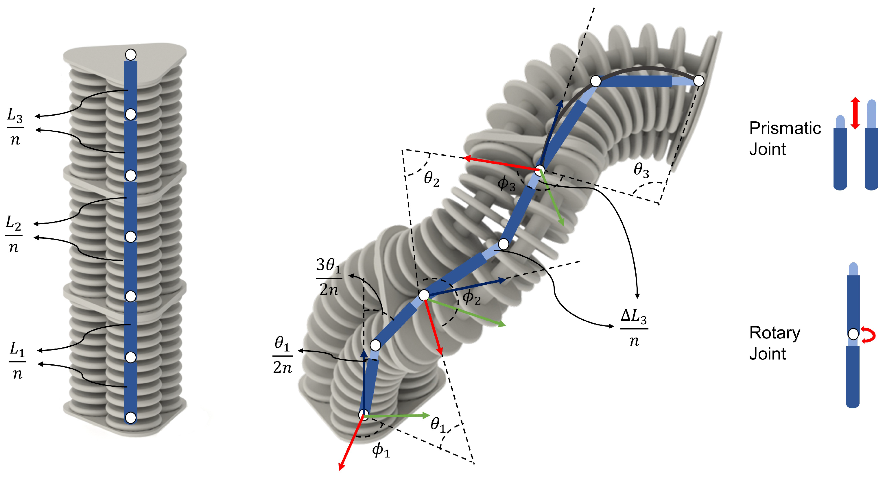

# Soft-Robots-Inverse-Kinematics

Inverse kinematics method for multi-segment, extensible, constant-curvature soft pneumatic robots. This code was developed during a mechanical engineering internship at the **Surgical Robotics Lab / Dynamics and Control Group, Eindhoven University of Technology (TU/e)**, and supports the results published in:

> M. Keyvanara, A. Goshtasbi, I. A. Kuling, "A Geometric Approach towards Inverse Kinematics of Soft Extensible Pneumatic Actuators Intended for Trajectory Tracking," *Sensors*, vol. 23, no. 15, p. 6882, 2023.
> [https://doi.org/10.3390/s23156882](https://doi.org/10.3390/s23156882)

## Overview

Soft pneumatic actuators are difficult to model accurately due to their nonlinear, continuous dynamics and hyper-elastic material behavior. This project approximates each segment of a multi-segment extensible soft robot as a set of rigid links connected by rotary and prismatic joints (a piecewise constant curvature approximation), then solves the inverse kinematics numerically to track a desired end-effector trajectory. The redundancy of the robot is additionally exploited for secondary tasks such as tip-angle control.

Watch video here:

[](https://www.youtube.com/watch?v=EYuKwtSX3gg)

## Repository contents

```
Matlab Code/
├── Inverse_Kinematic_main_script.m   — main script: sets up the robot, runs the IK solver, plots results
├── Inverse_Kinematics_final.m        — inverse kinematics function (rigid-link approximation + optimization)
└── forward_kinematics.m              — forward kinematics function (configuration → end-effector pose)

SolidWorks/
└── CAD model of the 3-segment, 3-bellow soft pneumatic actuator

Media/
└── Renders of the prototypes
```

## Method

Each soft segment is approximated as a chain of rigid links with rotary and prismatic joints, capturing both bending and extension:



Given this rigid-link model:

1. **Forward kinematics** (`forward_kinematics.m`) maps a set of configuration variables (per-segment curvature and extension) to the resulting end-effector position and orientation.
2. **Inverse kinematics** (`Inverse_Kinematics_final.m`) solves for the configuration variables that achieve a desired end-effector pose, using optimization rather than a closed-form solution — allowing the redundancy of multi-segment robots to be used for secondary objectives (e.g. constraining tip angle) in addition to trajectory tracking.
3. **`Inverse_Kinematic_main_script.m`** ties the two together: it defines the desired trajectory, calls the IK solver at each step, and visualizes the resulting robot configuration against the target.

## Running it

Open `Matlab Code/Inverse_Kinematic_main_script.m` in MATLAB and run it directly — it calls both `forward_kinematics.m` and `Inverse_Kinematics_final.m` from the same folder, so no path setup should be needed as long as all three files stay together.


## Citation

If you use this code, please cite the paper:

```bibtex
@Article{s23156882,
  AUTHOR  = {Keyvanara, Mahboubeh and Goshtasbi, Arman and Kuling, Irene A.},
  TITLE   = {A Geometric Approach towards Inverse Kinematics of Soft Extensible Pneumatic Actuators Intended for Trajectory Tracking},
  JOURNAL = {Sensors},
  VOLUME  = {23},
  YEAR    = {2023},
  NUMBER  = {15},
  ARTICLE-NUMBER = {6882},
  URL     = {https://www.mdpi.com/1424-8220/23/15/6882},
  DOI     = {10.3390/s23156882}
}
```


